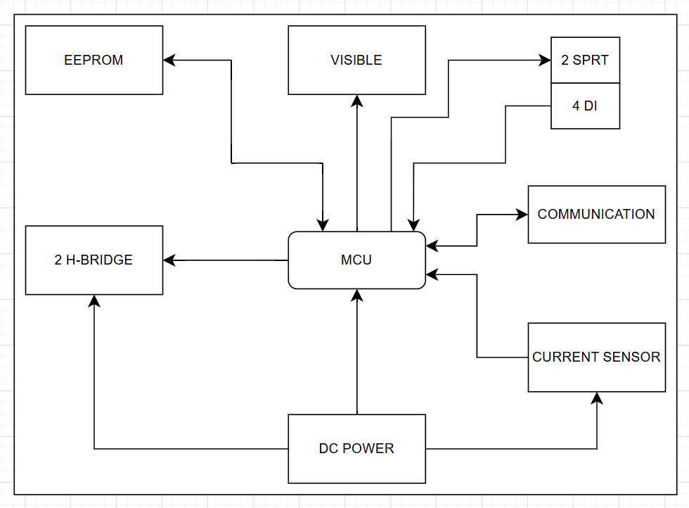

# 🔋 Dual Brushed DC Motor Driver

## 📌 Project Overview
This is a dual brushed DC motor driver module. The design is suitable for embedded systems and industrial automation applications that require robust and efficient motor control with up to 60W per channel.
- Dual independant H-Bridge 
- ACS712 current sensors
- AT24CXX EEPROM for logging

---

## 📐 System Architecture

---
## 🧰 Main Features

- ✅ Supports control of two independent brushed DC motors

- ✅ Supply voltage: 12V or 24V nominal

- ✅ Output current: up to 5A peak per motor, 3A continuous

- ✅ Full H-Bridge configuration for each motor

- ✅ PWM speed control with switching frequency up to 100kHz

- ✅ Direction control via digital logic inputs

Protection features:

- ✅ Current monitoring

- ✅ Flyback diode protection for inductive switching

- ✅ Opto-isolated control interface using 6N136
---
## 🔌 Modbus RTU Interface

- **Slave ID:** `0x03`
- **Baudrate:** `9600bps`, `8N1`

---